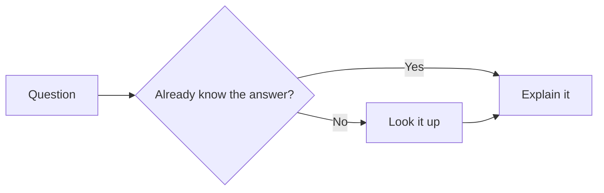
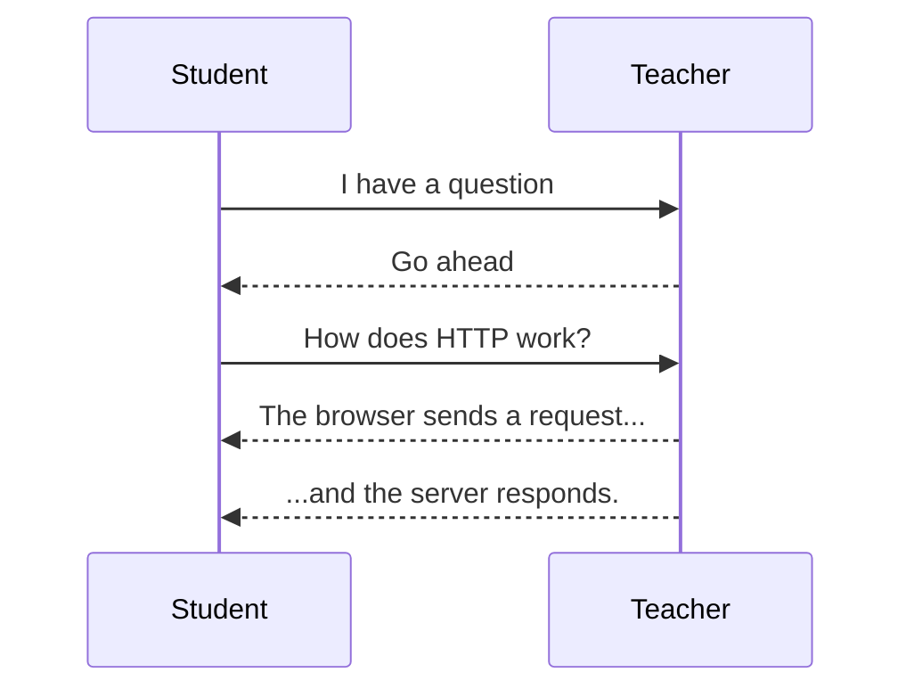
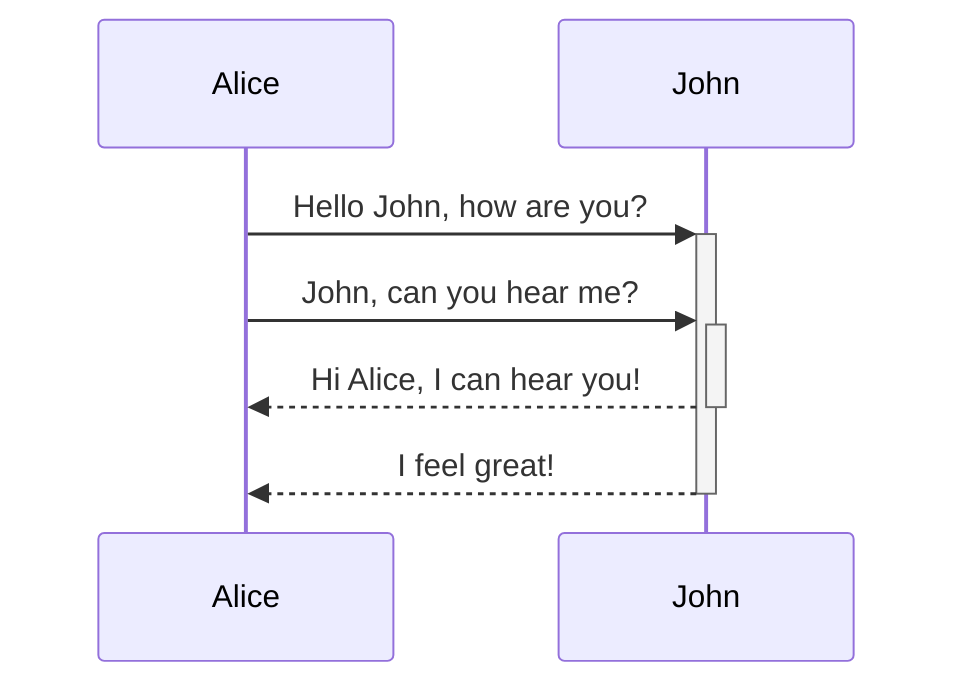

A picture is worth a thousand words — and a diagram that students can edit live in the browser is worth a thousand static slides.

The [Mermaid template](https://github.com/LiaTemplates/mermaid_template) brings [MermaidJS](https://mermaid.js.org) into LiaScript, letting you write diagrams as plain text and render them directly in your course.
Flowcharts, sequence diagrams, Gantt charts, entity-relationship diagrams, class diagrams, state machines, user-journey maps, pie charts — all from a few lines of text, no drawing tool required.

---

## What is Mermaid?

[Mermaid](https://mermaid.js.org) is a JavaScript-based diagramming library that turns text definitions into SVG graphics.
It is widely used on GitHub (which renders Mermaid code blocks natively), in documentation tools like Notion, Obsidian, and GitLab, and increasingly in educational contexts.

A simple flowchart looks like this:

``` text
flowchart LR
    A[Question] --> B{Already know the answer?}
    B -->|Yes| C[Explain it]
    B -->|No| D[Look it up]
    D --> C
```

The LiaScript template wraps MermaidJS into three macros that fit naturally into course authoring: a block macro, an inline macro, and an interactive eval macro.

---

## Quick Start

Add this import line to your LiaScript course header:

``` markdown
<!--
import: https://raw.githubusercontent.com/liaScript/mermaid_template/master/README.md
-->
```

For a version-stable import (recommended for published courses):

``` markdown
<!--
import: https://raw.githubusercontent.com/LiaTemplates/mermaid_template/0.1.4/README.md
-->
```

That's it. All three macros are now available throughout your document.

---

## Block Macro: `@mermaid` in the Fence Opener

The most natural way to use Mermaid in LiaScript is the fenced code block notation.
Add `@mermaid` directly in the fence opener — GitHub will show it as a readable code block, LiaScript will render it as a diagram.

```` markdown

````

Try it live:


<!--
import: https://raw.githubusercontent.com/liaScript/mermaid_template/master/README.md
-->

# Mermaid Demo




---

## Sequence Diagrams

Sequence diagrams are especially useful for explaining protocols, APIs, and communication flows between components or actors.

```` markdown

````


<!--
import: https://raw.githubusercontent.com/liaScript/mermaid_template/master/README.md
-->

# Sequence Diagram Demo




---

## Interactive Diagrams: `@mermaid_eval`

For hands-on learning, use `@mermaid_eval` directly after the closing fence.
This turns the code block into a LiaScript editor — learners can modify the diagram definition, click run, and see the updated graph immediately.

```` markdown

@mermaid_eval
````


<!--
import: https://raw.githubusercontent.com/liaScript/mermaid_template/master/README.md
-->

# Interactive Mermaid


@mermaid_eval


---

## Inline Macro: `@mermaid(...)`

For shorter diagrams embedded directly in the text flow, the inline macro accepts the Mermaid definition as a parameter:

```` markdown
@mermaid(```flowchart LR
    id1(This is the text in the box)```)
````

This is useful when a small diagram fits naturally between paragraphs without a full fenced block.

---

## Supported Diagram Types

MermaidJS supports a growing list of diagram types.
All of them work with the `@mermaid` and `@mermaid_eval` macros in LiaScript:

| Type | Description |
|------|-------------|
| `flowchart` / `graph` | Flow diagrams with nodes and edges |
| `sequenceDiagram` | Communication between actors over time |
| `gantt` | Project timelines and schedules |
| `erDiagram` | Entity-Relationship for database design |
| `classDiagram` | Object-oriented class structures |
| `stateDiagram-v2` | State machines and automata |
| `journey` | User journey maps |
| `pie` | Pie charts |
| `gitGraph` | Git branching and commit history |
| `mindmap` | Hierarchical topic maps |

---

## Full Template Demo

The Mermaid template README is itself a self-documenting LiaScript course covering all four usage patterns in detail:



---

## Use Cases

**Computer Science and Software Engineering** — Explain algorithms with flowcharts, model communication with sequence diagrams, document class hierarchies with class diagrams.
Use `@mermaid_eval` so students can modify and re-run the diagram as part of an exercise.

**Project management and planning** — Gantt charts help students understand project timelines, task dependencies, and scheduling in business or engineering courses.

**Database courses** — ER diagrams translate directly into Mermaid syntax.
Write the data model in the course, let students extend it, and render the result immediately.

**Process documentation** — Describe business processes, laboratory procedures, or decision trees in text form — maintainable, version-controllable, and GitHub-compatible.

**OER authoring** — Because Mermaid diagrams are pure text, they are fully accessible in Git diffs, searchable, and translatable.
No binary graphics files, no exported PNGs that get out of sync with the content.

---

## Technical Facts

| | |
|---|---|
| **Runs in browser** | Yes — no server, no backend |
| **Interactive editing** | Yes, with `@mermaid_eval` |
| **External API** | No (CDN script loaded once on first use) |
| **Offline capable** | After first load (MermaidJS cached) |
| **MermaidJS version** | 10.5.0 (pinned) |
| **License** | MIT |
| **Maintained** | Stable — last release `0.1.4`, no active development |
| **Version-stable import** | Yes (`0.1.4` tag available) |

> **Note on the import URL:** The template repository was originally hosted under the `liaScript` GitHub organization. The canonical import URL still uses `liaScript` (lowercase s): `https://raw.githubusercontent.com/liaScript/mermaid_template/master/README.md`. The version-stable import uses the `LiaTemplates` organization: `https://raw.githubusercontent.com/LiaTemplates/mermaid_template/0.1.4/README.md`.

---

## Try It







---

## Related Templates

- [**plantUML**](https://github.com/LiaTemplates/plantUML) — UML diagrams (class, sequence, use-case, activity) via PlantUML
- [**dbdiagram**](https://github.com/LiaTemplates/dbdiagram) — Entity-Relationship diagrams with the dbdiagram.io syntax
- [**Tikz-Jax**](https://github.com/LiaTemplates/Tikz-Jax) — render TikZ/LaTeX figures directly in the browser
- [**JSXGraph**](/blog/jsxgraph-and-liascript-a-perfect-match) — interactive mathematical visualizations for geometry and function graphs
